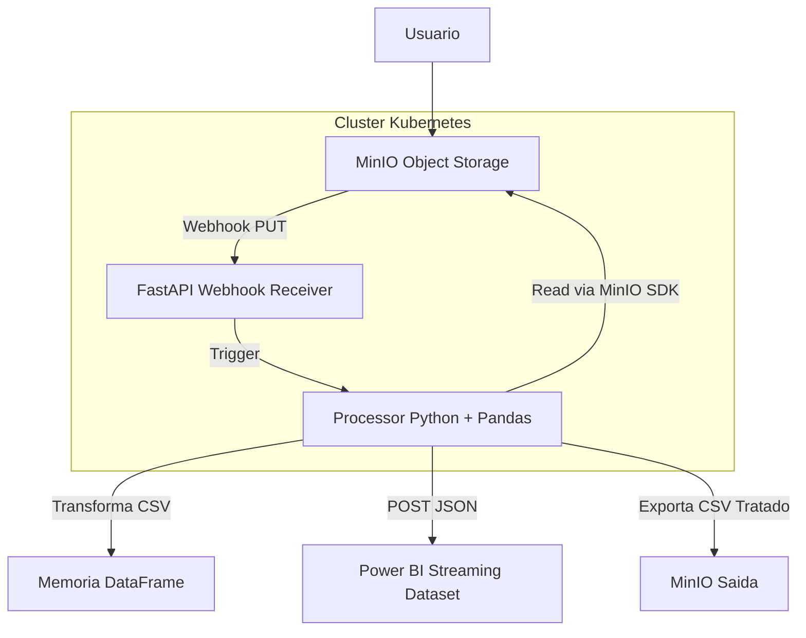

# 🧪 Mini Pipeline IVI — Projeto de Arquitetura de Dados

Este projeto simula um pipeline real utilizado por empresas de ciência de dados, como a IVI Data Science. Ele é focado em ingestão, transformação e entrega de dados estruturados em tempo real, usando componentes modernos, desacoplados e prontos para rodar em Kubernetes.

---

## 🎯 Objetivo

Demonstrar capacidade arquitetural e técnica para:
- Receber arquivos CSV via upload.
- Armazenar os arquivos em object storage (MinIO).
- Detectar novos arquivos via webhook.
- Processar os dados com Pandas de forma desacoplada.
- Enviar os dados tratados diretamente para o Power BI (Streaming Dataset).
- Rodar tudo em ambiente orquestrado com Kubernetes (MicroK8s no lab).

---

## ⚙️ Componentes

| Serviço     | Tecnologia         | Função                                          |
|-------------|--------------------|--------------------------------------------------|
| MinIO       | Object Storage S3  | Armazena arquivos CSV recebidos                 |
| FastAPI     | Webhook Receiver   | Captura eventos do MinIO e aciona o Processor   |
| Processor   | Python + Pandas    | Realiza o ETL, trata dados e envia ao Power BI  |
| Power BI    | Streaming Dataset  | Visualiza dados tratados em tempo real          |
| Orquestração| Kubernetes / Docker Compose | Gerencia deploys e execução local/lab     |

---

## 🧠 Arquitetura Infra/Pipeline



---

## 📦 Estrutura de Diretórios

```
mini-pipeline-ivi/
├── dic/                    # Doc do projeto
├── api/                    # Código da API FastAPI (webhook)
├── terraform/              # IaC para k8s, AWS, Azure e OpenStack
├── Dockerfile.api          # Imagem da API FastAPI
├── Dockerfile.processor    # Imagem do Processor
├── Makefile                # Comandos úteis para build e automações
├── .env.dev                # Variáveis para desenvolvimento
├── .env.homolog            # Variáveis para homologação
├── .env.prod               # Variáveis para produção
├── README.md               # Este arquivo
```

---

## 🚀 Como rodar (modo local)

### Pré-requisitos

- Docker
- Docker Compose
- Power BI com Streaming Dataset configurado (chave de ingestão)
- `make` instalado (opcional, mas recomendado)
- `mc` (MinIO Client) instalado e configurado
- Terraform instalado

### Passos

1. **Build dos serviços**
```bash
make build
```

   Ajuste as variáveis de ambiente nos arquivos `.env.dev`, `.env.homolog` ou
   `.env.prod` conforme necessário.

2. **Subir tudo com Docker Compose**
Escolha o ambiente desejado. Por exemplo:
```bash
make dev       # desenvolvimento
make homolog   # homologação
make prod      # produção
```

3. **Ver logs da API**
```bash
make logs
```

4. **Criar bucket e configurar webhook no MinIO**
```bash
mc alias set local http://localhost:9000 minioadmin minioadmin
mc mb local/teste
mc admin config set local notify_webhook:1 endpoint="http://api:8000/webhook/csv"
mc admin service restart local
mc event add local/teste arn:minio:sqs::1:webhook --event put --suffix .csv
```

5. **Enviar CSV manualmente**
```bash
mc cp dados.csv local/teste/
```

6. **Ver relatório no Power BI**
> Configure seu dashboard com base no Streaming Dataset correspondente.

## 🚀 Deploy com Terraform

Escolha o ambiente desejado (`k8s`, `aws`, `azure` ou `openstack`):
```bash
make deploy ENV=k8s
```
Este comando executa `terraform apply` na pasta `terraform/<ENV>`.

---

## 🔄 Melhorias futuras

- Persistência de dados tratados (ex: SQLite, PostgreSQL)
- Agendamento de reprocessamento (Celery ou CronJob)
- Upload de CSV via frontend (UI simples com Dropzone.js)
- Fila para desacoplamento total do Processor (Redis, Kafka)
- Autenticação nos endpoints
- Observabilidade com Prometheus + Grafana
- Versionamento de arquivos tratados (via timestamp ou hash)

---

## 👨‍💻 Autor

Desenvolvido por **Alan Ramalho** como prova de conceito de arquitetura moderna, modular e orientada a eventos para uso real em projetos de ciência de dados e business intelligence.