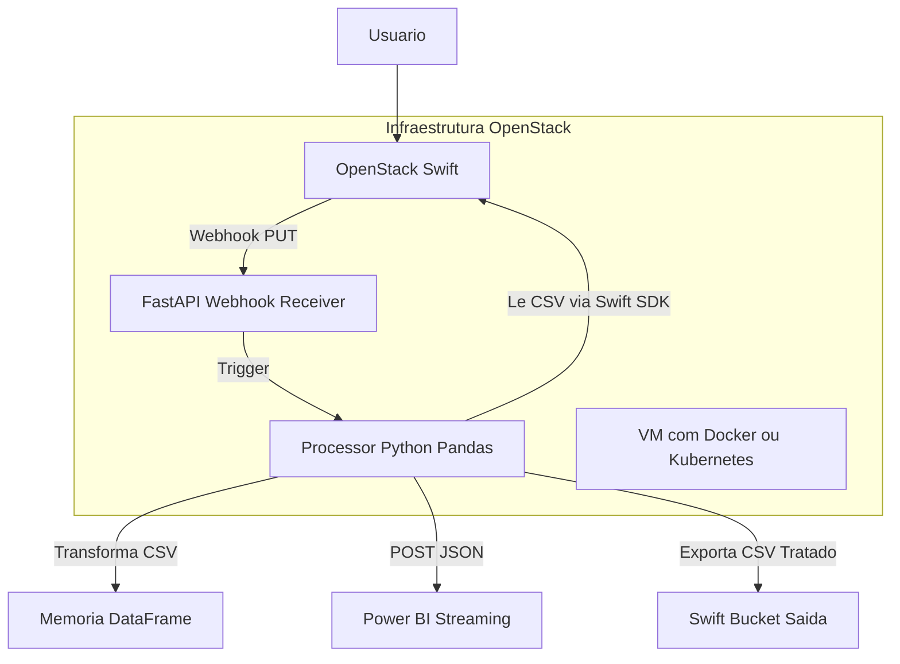

# ☁️ Mini Pipeline IVI com OpenStack – Arquitetura Escalável para Ingestão e Visualização de Dados

Este projeto demonstra uma arquitetura de pipeline de dados totalmente orquestrada sobre infraestrutura OpenStack, simulando uma entrega real de valor para times de ciência de dados. Utiliza serviços nativos como **Swift**, **instâncias VM/container**, e integrações externas como **Power BI**.

---

## 🎯 Objetivo

- Receber arquivos `.csv` via API ou interface web.
- Armazenar os arquivos no **OpenStack Swift** (Object Storage).
- Detectar novos arquivos e processá-los com **FastAPI + Pandas**.
- Enviar os dados tratados para o **Power BI Streaming Dataset**.
- Executar toda a orquestração em VMs ou containers gerenciados no OpenStack.

---

## 👷🏾‍♂️ Arquitetura Infra/Pipeline [OPENSTACK]



## 🧱 Componentes da Arquitetura

| Camada             | Tecnologia                      | Função                                                  |
|--------------------|----------------------------------|---------------------------------------------------------|
| Object Storage     | OpenStack Swift                 | Armazenamento dos arquivos `.csv`                       |
| Processamento      | FastAPI + Pandas (em VM/Pod)    | Validação, transformação e envio                        |
| Trigger            | Script de monitoramento ou webhook de Swift | Detecta novos objetos e inicia o pipeline    |
| Entrega            | Power BI Streaming Dataset       | Recebe dados via API para dashboards                    |
| Orquestração       | OpenStack + Ansible/Heat         | Gerencia infraestrutura da pipeline                     |

---

## 🔁 Fluxo da Pipeline

```plaintext
🔼 Upload CSV (UI/API)
    ↓
📦 Swift (Object Storage)
    ↓
🔔 Evento ou Monitoramento detecta novo objeto
    ↓
🐍 FastAPI/Pandas (em VM/container)
    ↓
📤 Push via POST para Power BI
    ↓
📊 Dashboards em tempo real

---

## 🛰️ Serviços OpenStack Utilizados

| Serviço      | Função Principal                                         |
|--------------|----------------------------------------------------------|
| **Swift**    | Armazenamento de objetos para arquivos `.csv`            |
| **Nova**     | Execução das VMs que hospedam a API e o Processor         |
| **Magnum**   | Gerenciamento opcional de clusters Kubernetes/containers |
| **Keystone** | Autenticação e autorização dos componentes               |
| **Heat**     | Orquestração da infraestrutura como código               |

